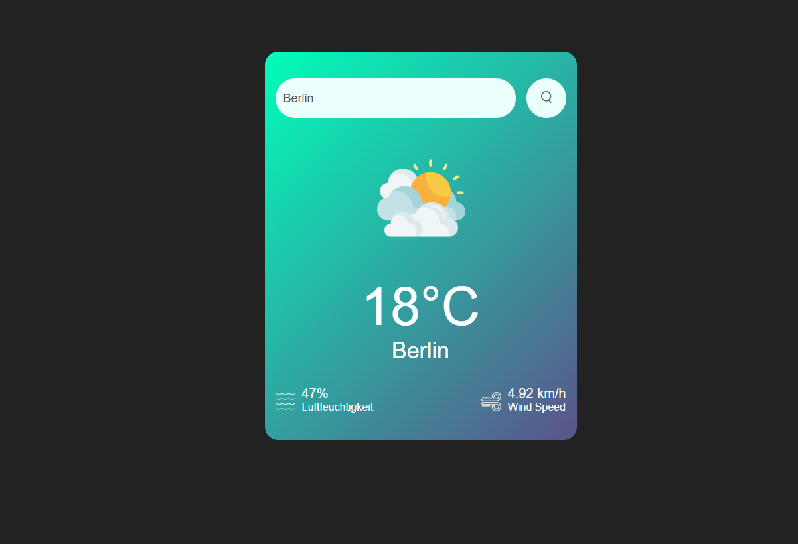

# 🌤️ Weather App – Live Weather Forecast

Eine moderne und responsive Wetter-App, die aktuelle Wetterdaten live über die OpenWeatherMap API abruft. Die Anwendung ermöglicht die Suche nach Städten weltweit und zeigt Wetterinformationen übersichtlich und in Echtzeit an.

## 🚀 Live Demo

👉 https://ismael993-create.github.io/wetter-app-api/

## 📸 Preview



## 🧩 Projektbeschreibung

Die Weather App ist eine Single-Page-Anwendung, die aktuelle Wetterdaten für beliebige Städte weltweit abruft und visuell ansprechend darstellt.

Über die OpenWeatherMap API werden Wetterinformationen asynchron geladen, verarbeitet und direkt im Browser angezeigt.

Die Anwendung bietet:

* Live-Wetterdaten für Städte weltweit
* Automatische Suchvorschläge während der Eingabe
* Dynamische Wetter-Icons passend zur Wetterlage
* Anzeige von Temperatur, Luftfeuchtigkeit und Windgeschwindigkeit
* Fehlerbehandlung bei ungültigen Städten
* Responsive Darstellung für Desktop, Tablet und Smartphone

---

## ✨ Features

### 🔍 Stadtsuche

* Suche nach Städten weltweit
* Live-Vorschläge während der Eingabe
* Sofortige Wetterabfrage per Klick oder Enter-Taste

### 🌡️ Wetterinformationen

* Aktuelle Temperatur in °C
* Luftfeuchtigkeit in %
* Windgeschwindigkeit
* Lokalisierte Wetterdaten auf Deutsch

### 🎨 Dynamische Wetter-Icons

Je nach Wetterlage werden passende Icons angezeigt:

* ☀️ Clear
* ☁️ Clouds
* 🌧️ Rain
* 🌦️ Drizzle
* 🌫️ Mist

### 📱 Responsive Design

* Desktop-optimierte Darstellung
* Tablet-Unterstützung
* Mobile-freundliches Layout

---

## 🛠️ Verwendete Technologien

* HTML5
* CSS3
* Vanilla JavaScript (ES6+)
* Fetch API
* Async / Await
* OpenWeatherMap API

---

## ⚙️ JavaScript-Funktionalität

### API-Kommunikation

* Asynchrones Abrufen von Wetterdaten über Fetch API
* Verarbeitung von JSON-Daten
* Fehlerbehandlung bei ungültigen Suchanfragen

### Dynamische DOM-Manipulation

* Aktualisierung der Wetterdaten ohne Seitenreload
* Dynamisches Wechseln der Wetter-Icons
* Erzeugen und Entfernen von Suchvorschlägen

### Suchvorschläge

* Nutzung der OpenWeatherMap Geocoding API
* Dynamisches Nachladen passender Städte
* Auswahl per Mausklick

---

## 🎯 Lernziele des Projekts

* Arbeiten mit REST APIs
* Nutzung von Async/Await
* Verarbeitung von JSON-Daten
* Dynamische DOM-Manipulation
* Fehlerbehandlung bei API-Anfragen
* Entwicklung responsiver Benutzeroberflächen
* Strukturierung von JavaScript-Code

---

## 📂 Projektstruktur

```text
Weather-App/
│
├── index.html
├── style.css
├── script.js
│
├── img/
│   ├── clear.png
│   ├── clouds.png
│   ├── rain.png
│   ├── drizzle.png
│   ├── mist.png
│   ├── humidity.png
│   ├── wind.png
│   └── search.png
│
└── README.md
```

## 🔗 API

Die Wetterdaten werden über die OpenWeatherMap API bereitgestellt.

https://openweathermap.org/api

---

## 👨‍💻 Autor

Erstellt von Ismael Toumi
